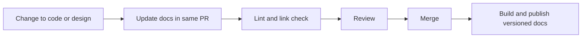

- **Owner:** Build and tooling lead
- **Applies to:** All documentation describing the product, its design or the way it is built
- **Enforcement:** CI (lint, link check, build), review
- **Related:** [EG-001](eg-001-guidelines-governance.md), [EG-005](eg-005-ai-agent-usage.md), [EG-008](eg-008-decision-records.md)
- **Principles:** WP-01 to WP-10 (see [principles.md](../business-principles/principles.md))

> **Note:** Rules marked *(core)* apply to every product and cannot be tailored. Other rules, and all numeric values, are proposed defaults that a product may tailor in its conformance profile ([EG-001](eg-001-guidelines-governance.md)).

## Purpose

Treat documentation with the same discipline as source code so that it stays accurate, reviewable and close to what it describes, and give the team one shared vocabulary.

## Rules

1. **DOC-01** *(core)* Documentation MUST be stored as plain text in the same repository as the thing it describes, or in a designated documentation repository referenced from it.
1. **DOC-02** Documents MUST be written in Markdown with a defined style guide enforced by a linter.
1. **DOC-03** *(core)* Changes to documentation MUST go through the same PR and review process as code.
1. **DOC-04** *(core)* A change that alters behaviour, an interface, a configuration option or a build step MUST update the affected documentation in the same PR.
1. **DOC-05** Diagrams MUST be authored as text (Mermaid or PlantUML) and stored as source. Exported images MUST NOT be the only copy.
1. **DOC-06** Every document MUST have front matter identifying its owner, status and last review date.
1. **DOC-07** The pipeline MUST build the documentation, fail on broken links and lint errors, and publish it as a versioned artefact with each release.
1. **DOC-08** *(core)* Each repository MUST provide the minimum document set: `README`, `CONTRIBUTING`, `AGENTS.md`, architecture overview, build and test instructions, and `docs/adr/`.
1. **DOC-09** Generated documentation (API reference, register maps, trace reports, decision log index) MUST be generated by the pipeline and MUST NOT be edited by hand.
1. **DOC-10** Documents SHOULD state the question they answer and their audience in the first paragraph, and SHOULD be split by purpose: tutorial, how-to, reference or explanation.
1. **DOC-11** Writing SHOULD be plain British English: short sentences, one idea per paragraph, active voice, conclusion first, acronyms defined at first use.
1. **DOC-12** The team MUST maintain a single glossary at `docs/reference/glossary.md`. A term is defined once and used consistently in requirements, code identifiers and documents. New terms are added by PR.
1. **DOC-13** File names, requirement IDs, component names and identifiers MUST follow the naming conventions in the style guide (kebab-case for files, stable IDs for artefacts).
1. **DOC-14** Approval of a document SHOULD be the PR approval. Separate signature records SHOULD NOT be used unless a regulation requires them ([EG-023](eg-023-safety-regulatory-and-certification.md)).
1. **DOC-15** Documents MUST be structured (headings, front matter, IDs) so that both people and agents can navigate them. Long documents SHOULD be split rather than nested deeply.

## Layout

```text
repo/
  README.md
  CONTRIBUTING.md
  AGENTS.md
  docs/
    architecture/
    adr/
    rfc/
    requirements/
    research/
    guidelines/
    how-to/
    reference/
```

## Change flow



## Compliance

| Rule | Checked by |
|------|------------|
| DOC-02, DOC-06, DOC-13 | Markdown linter and front matter schema check in CI |
| DOC-05, DOC-07, DOC-09 | Documentation build job in CI |
| DOC-04 | PR template checklist item |
| DOC-08 | Repository template check |
| DOC-12 | Glossary term check (optional linter) and review |

## Checklist

Tick an item when it is true for your project. Rule IDs point to the detail above.

- [ ] Documents are plain-text Markdown in the repository and linted (DOC-01, DOC-02)
- [ ] Documentation changes go through PR like code (DOC-03)
- [ ] Changes to behaviour, interfaces, configuration and build steps update docs in the same PR (DOC-04)
- [ ] Diagrams are Mermaid or PlantUML source (DOC-05)
- [ ] Every document has front matter with owner, status and review date (DOC-06)
- [ ] CI builds the docs, fails on broken links and lint errors, and publishes versioned docs with each release (DOC-07)
- [ ] The minimum document set exists: README, CONTRIBUTING, `AGENTS.md`, architecture overview, build and test instructions, `docs/adr/` (DOC-08)
- [ ] Generated docs are generated and never hand-edited (DOC-09)
- [ ] Documents state their question and audience, and are split by purpose (DOC-10)
- [ ] Writing is plain British English with the conclusion first (DOC-11)
- [ ] A single glossary exists and terms are used consistently (DOC-12)
- [ ] Naming conventions are followed for files, IDs and components (DOC-13)
- [ ] Approval is PR approval unless a regulation requires a signature record (DOC-14)
- [ ] Documents are structured with headings, front matter and IDs so people and agents can navigate them (DOC-15)

## Applying to personal projects and AI agents

### Personal projects

Starts at the **Starter** profile (see [personal-projects.md](personal-projects.md)). Start with a README and `AGENTS.md`. Add `docs/adr/` and Mermaid diagrams at the Standard profile. Front matter and a glossary become worthwhile once several people or agents share the same terms.

### AI agents

- Update docs in the same change as the behaviour they describe (DOC-04).
- Never hand-edit generated docs (DOC-09).
- Draw diagrams as Mermaid text and avoid semicolons in labels because they break rendering.
- Write plain British English with the conclusion first (DOC-11).
- Check every statement in a doc against the code before committing (AGT-15).
