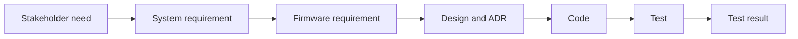

- **Owner:** Systems engineering lead
- **Applies to:** All product requirements at every level
- **Enforcement:** CI (trace report and gates), review
- **Related:** [EG-003](eg-003-quality-policy-and-attributes.md), [EG-008](eg-008-decision-records.md), [EG-014](eg-014-version-control-and-versioning.md), [EG-017](eg-017-testing-principles-and-strategy.md), [EG-023](eg-023-safety-regulatory-and-certification.md)
- **Principles:** RP-01 to RP-08 (see [principles.md](principles.md))

> **Note:** Rules marked *(core)* apply to every product and cannot be tailored. Other rules, and all numeric values, are proposed defaults that a product may tailor in its conformance profile ([EG-001](eg-001-guidelines-governance.md)).

## Purpose

Ensure that everything we build traces to a need and everything we need is verified, with the evidence produced by the pipeline rather than assembled by hand.

## Rules

1. **REQ-01** Requirements MUST be decomposed through defined levels (stakeholder and system, subsystem, firmware and component). Each requirement is allocated to the next level down, and the allocation is recorded.
1. **REQ-02** A requirement MUST be atomic, unambiguous, feasible, necessary, consistent and verifiable. It MUST state one verification method: test, analysis, inspection or demonstration.
1. **REQ-03** *(core)* Requirements MUST be stored as text in the repository beside the design, with stable IDs of the form `REQ-<AREA>-<nnnn>`. IDs are never reused.
1. **REQ-04** Each requirement MUST carry a rationale, a parent, an owner and a status: `draft`, `approved`, `implemented`, `verified`, `retired`. Retired requirements are never deleted.
1. **REQ-05** Requirements MUST be baselined at each release by tag. Changes are made by PR, and history is kept in version control.
1. **REQ-06** *(core)* Requirement IDs MUST be referenced in commit footers, PR descriptions, test names and, where non-obvious, code comments and ADRs.
1. **REQ-07** Every approved requirement MUST be allocated to a design element, implemented and verified. Every test MUST trace to a requirement. Every significant code unit MUST trace to a requirement or an approved technical need.
1. **REQ-08** The pipeline MUST generate a trace report from requirement to design, code, test and result. Gaps produce warnings on `draft` requirements and failures on `approved` requirements at release.
1. **REQ-09** A change to a requirement MUST trigger a change impact check that flags dependent requirements, tests and documents. The PR MUST acknowledge each flagged item.
1. **REQ-10** A requirement MUST be reviewed by its author, an implementer and a verifier before it is approved.
1. **REQ-11** Non-functional requirements SHOULD be selected from the NFR catalogue ([EG-003](eg-003-quality-policy-and-attributes.md)).
1. **REQ-12** Regulatory and security requirements MUST be captured as requirements with the same rules ([EG-022](eg-022-security-and-data-protection.md), [EG-023](eg-023-safety-regulatory-and-certification.md)).
1. **REQ-13** Work items MUST link to a requirement or a defect. Work with neither (tooling, refactoring) MUST state its justification.

## Traceability chain



## Requirement example

```yaml
id: REQ-FW-0142
title: Dual-bank image staging
statement: The firmware shall stage a received image in the inactive bank without interrupting normal operation.
type: functional
level: firmware
parent: REQ-SYS-0031
verification: test
status: approved
owner: Update team
rationale: Avoids service interruption during updates.
```

## Compliance

| Rule | Checked by |
|------|------------|
| REQ-03, REQ-04 | CI: requirement schema and ID uniqueness check |
| REQ-06 | CI: commit footer check, test naming check |
| REQ-07, REQ-08 | CI: trace report gate on release branches |
| REQ-09 | PR template item and change impact report |

## Checklist

Tick an item when it is true for your project. Rule IDs point to the detail above.

- [ ] Requirement levels and allocation rules are defined (REQ-01)
- [ ] Each requirement is atomic, unambiguous, feasible, necessary, consistent and verifiable, with one verification method (REQ-02)
- [ ] Requirements are stored as text in the repository with stable `REQ-<AREA>-<nnnn>` IDs (REQ-03)
- [ ] Each requirement has a rationale, parent, owner and status (REQ-04)
- [ ] Requirements are baselined by tag at each release (REQ-05)
- [ ] IDs are referenced in commit footers, PRs and test names (REQ-06)
- [ ] Every approved requirement is allocated, implemented and verified, and every test traces to a requirement (REQ-07)
- [ ] The pipeline generates a trace report with gap gates (REQ-08)
- [ ] A requirement change triggers a change impact check (REQ-09)
- [ ] Requirements are reviewed by author, implementer and verifier before approval (REQ-10)
- [ ] Non-functional requirements are selected from the NFR catalogue (REQ-11)
- [ ] Regulatory and security requirements are captured as requirements (REQ-12)
- [ ] Work items link to a requirement or defect, or state their justification (REQ-13)

## Applying to personal projects and AI agents

### Personal projects

Starts at the **Standard** profile (see [personal-projects.md](personal-projects.md)). Keep a short `docs/requirements/` list with IDs and a one-line verification each, and reference IDs with `Refs:` in commits. Skip formal levels and three-way review. For a small script, a 'what it must do' list in the README is enough.

### AI agents

- Before implementing, find the requirement ID or IDs the task serves and cite them in commits (`Refs: REQ-...`) and test names (REQ-06).
- If there is no requirement, say so and ask, or propose one for review (REQ-13).
- Never edit approved requirements without instruction, and flag the impact on tests and docs (REQ-09).
