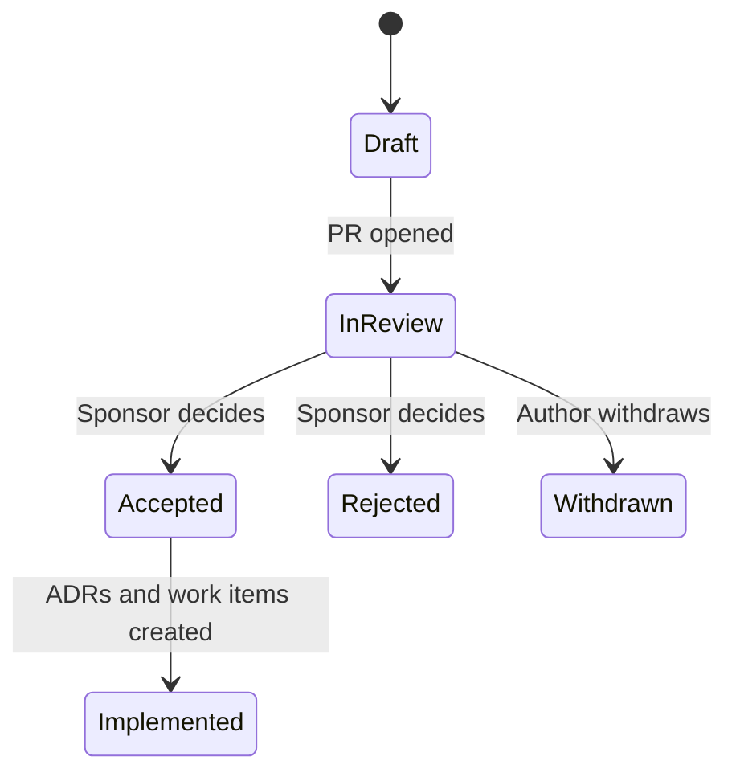

- **Owner:** Architecture group
- **Applies to:** All significant technical, process and guideline decisions
- **Enforcement:** Review, CI (format and link checks)
- **Related:** [EG-001](eg-001-guidelines-governance.md), [EG-002](eg-002-values-and-ways-of-working.md), [EG-004](eg-004-documentation-as-code.md), [EG-007](eg-007-architecture-principles.md)

> **Note:** Rules marked *(core)* apply to every product and cannot be tailored. Other rules, and all numeric values, are proposed defaults that a product may tailor in its conformance profile ([EG-001](eg-001-guidelines-governance.md)).

## Purpose

Give significant proposals a structured, time-boxed and inclusive way to gather input across sites and disciplines (the RFC), and record the outcome with its context so that it is not re-litigated, misremembered or lost (the ADR).

## RFC or ADR?

The RFC is the discussion. The ADR is the outcome. Small decisions with an obvious owner go straight to an ADR. Anything with real disagreement, cross-team impact or a high cost of being wrong starts as an RFC, and produces one or more ADRs.

A decision needs an ADR if it is hard or costly to reverse, or affects more than one team or component. Examples: choice of RTOS, bootloader, update mechanism or cryptographic scheme, flash layout, an interface between components, adopting or dropping a significant tool or dependency, and a deviation from a guideline that is likely to recur.

## Rules

1. **ADR-01** *(core)* ADRs MUST be stored in `docs/adr/` in the repository they affect, numbered sequentially and named `NNNN-short-title.md`.
1. **ADR-02** ADRs MUST use the standard template (below).
1. **ADR-03** *(core)* An ADR MUST be proposed by PR. Merging with status `accepted` is the record of approval.
1. **ADR-04** *(core)* An accepted ADR MUST be immutable apart from status and links. A changed decision is a new ADR that supersedes the old one, and the old ADR MUST be updated to point to it.
1. **ADR-05** Each ADR MUST record at least two considered options, including "do nothing" where relevant, with reasons for rejection.
1. **ADR-06** Each ADR MUST state its consequences, including negative ones, and how the decision will be verified.
1. **ADR-07** ADRs SHOULD link to the requirements they satisfy, the principles that apply (PRN-01), the RFC that led to them, and the PRs that implement them. Implementing commits SHOULD carry an `ADR:` footer.
1. **ADR-08** ADRs SHOULD be written before or during implementation. Retrospective ADRs are acceptable for undocumented existing decisions and MUST be marked as such.
1. **ADR-09** A decision log index MUST be generated from ADR front matter.
1. **RFC-01** *(core)* An RFC MUST be used for new or changed guidelines, cross-team interface changes, adoption of major tools or dependencies, and changes to the release or update process.
1. **RFC-02** RFCs MUST be stored in `docs/rfc/`, numbered, and proposed by PR so that discussion is attached to the text.
1. **RFC-03** Each RFC MUST name an author, a sponsor with authority to decide, and the affected teams and sites.
1. **RFC-04** Each RFC MUST have a comment period of at least five working days (longer when several time zones are involved) and a stated decision date.
1. **RFC-05** Affected teams MUST be notified explicitly. Silence from a team that was not told is not consent.
1. **RFC-06** Each RFC MUST include: problem statement, goals and non-goals, proposal, alternatives, impact (including migration and cost), risks and open questions.
1. **RFC-07** The sponsor MUST record the outcome (`accepted`, `rejected`, `withdrawn`) with a short rationale and a summary of unresolved objections.
1. **RFC-08** An accepted RFC MUST result in one or more ADRs and, where relevant, guideline updates. The RFC then becomes read-only.
1. **RFC-09** RFCs SHOULD be short. A proposal that needs more than five pages should be split.
1. **RFC-10** Written comment is the default. Meetings are for resolving disagreements, and their outcomes MUST be written back to the RFC (VAL-06).
1. **RFC-11** The architecture group MUST run a forum on a fixed cadence (proposed: fortnightly) where open RFCs are decided. Every RFC has a decision date, and an RFC not decided by then MUST be decided, deferred with a written reason, or withdrawn.
1. **RFC-12** Architecture review MUST be limited to architecturally significant changes: a cross-component interface, an architecture principle, a quality attribute target, a component boundary or the adoption of a technology. Other decisions belong to the component owner (VAL-02).

## ADR template

```markdown
---
id: ADR-0000
title: Short imperative title
status: proposed | accepted | rejected | deprecated | superseded
date: YYYY-MM-DD
deciders: [names or roles]
principles: [AP-00]
requirements: [REQ-...]
rfc:
supersedes:
superseded-by:
---

## Context

What is the problem, and what forces (technical, regulatory, schedule) apply?

## Decision drivers

- Driver 1
- Driver 2

## Options considered

1. Option A: summary, pros, cons
1. Option B: summary, pros, cons

## Decision

We will do X, because Y.

## Consequences

- Positive:
- Negative:
- Follow-up actions:

## Verification

How will we know this decision is working?
```

## RFC lifecycle



## Compliance

| Rule | Checked by |
|------|------------|
| ADR-01, ADR-02, ADR-09 | CI: ADR front matter and heading validation, index generation |
| ADR-03, ADR-04 | Branch protection, CI: accepted ADR content immutability check |
| ADR-07, RFC-08 | Review, PR template item |
| RFC-11, RFC-12 | Forum calendar and decision log review |
| RFC-01 to RFC-07 | RFC template validation in CI, sponsor review |

## Checklist

Tick an item when it is true for your project. Rule IDs point to the detail above.

- [ ] ADRs live in `docs/adr/`, are numbered and use the template (ADR-01, ADR-02)
- [ ] ADRs are proposed by PR and merged as `accepted` (ADR-03)
- [ ] Accepted ADRs are immutable apart from status and links, and superseding ADRs point back (ADR-04)
- [ ] At least two options and the reasons for rejection are recorded (ADR-05)
- [ ] Consequences and verification are stated (ADR-06)
- [ ] ADRs link to requirements, principles, RFCs and PRs, and commits use the `ADR:` footer (ADR-07)
- [ ] ADRs are written before or during implementation, and retrospective ones are marked (ADR-08)
- [ ] A decision log index is generated (ADR-09)
- [ ] RFCs are used for guideline changes, cross-team interfaces, major tools and release changes (RFC-01)
- [ ] RFCs are stored in `docs/rfc/`, proposed by PR, short, and discussed in writing by default (RFC-02, RFC-09, RFC-10)
- [ ] Each RFC names an author, sponsor, affected teams, comment period and decision date (RFC-03, RFC-04)
- [ ] Affected teams are notified explicitly (RFC-05)
- [ ] Each RFC covers problem, goals, proposal, alternatives, impact, risks and open questions (RFC-06)
- [ ] Outcome and rationale are recorded and ADRs created (RFC-07, RFC-08)
- [ ] An architecture forum meets on a fixed cadence and every RFC is decided, or deferred with a reason, by its decision date (RFC-11)
- [ ] Architecture review is limited to architecturally significant changes, and other decisions belong to component owners (RFC-12)

## Applying to personal projects and AI agents

### Personal projects

Starts at the **Standard** profile (see [personal-projects.md](personal-projects.md)). Keep ADRs. They are your memory and your agents' memory. Replace RFCs with a short design note in `docs/rfc/` for large changes, with no comment period and you as sponsor.

### AI agents

- When a decision is significant, hard to reverse or crosses component boundaries, draft an ADR with status `proposed` from `docs/templates-reference/adr.md` instead of implementing silently (ADR-03).
- Do not edit accepted ADRs, supersede them (ADR-04).
- Read `docs/adr/` before changing behaviour it governs.
- Record at least two options (ADR-05).
