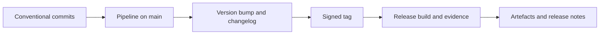

- **Owner:** Build and tooling lead
- **Applies to:** All repositories, branches, commits, tags and versioned artefacts
- **Enforcement:** Hooks, CI, branch protection
- **Related:** [EG-006](eg-006-requirements-and-traceability.md), [EG-008](eg-008-decision-records.md), [EG-015](eg-015-pull-requests-and-review.md), [EG-016](eg-016-pipelines-and-quality-gates.md), [EG-021](eg-021-release-update-and-production.md), [EG-026](eg-026-competence-tooling-and-onboarding.md), [EG-010](eg-010-components-reuse-and-variants.md)

> **Note:** Rules marked *(core)* apply to every product and cannot be tailored. Other rules, and all numeric values, are proposed defaults that a product may tailor in its conformance profile ([EG-001](eg-001-guidelines-governance.md)).

## Purpose

Keep history clean, meaningful and machine-readable, so that version numbers, changelogs, release notes and trace reports are generated from it rather than written by hand.

## Rules

1. **VCS-01** *(core)* Git MUST be the single source of truth. The repository structure MUST be documented, and the choice of monorepo or multi-repo (with its multi-repo tool) recorded in an ADR. Large binaries MUST use LFS or an artefact store. Secrets and build outputs MUST NOT be committed.
1. **VCS-02** The branching model MUST be trunk-based: a protected `main` and short-lived branches (target under three days) named `feat/`, `fix/`, `docs/` or `chore/` with the ticket ID. Release branches are used only for maintenance of supported versions.
1. **VCS-03** *(core)* Commit messages MUST follow Conventional Commits, using the allowed types (below) and scopes mapped to components in a scope file.
1. **VCS-04** *(core)* A breaking change MUST be marked with `!` and a `BREAKING CHANGE:` footer.
1. **VCS-05** *(core)* Footers MUST include `Refs:` for requirement or ticket IDs. They SHOULD include `ADR:` where relevant, and MUST include `Assisted-by:` where AI assisted (AGT-06).
1. **VCS-06** Commits SHOULD be atomic and buildable, so that bisection works.
1. **VCS-07** *(core)* Commit format MUST be enforced by a commit-msg hook (installed by one command) and by a CI lint.
1. **VCS-08** *(core)* `main` MUST have linear history through squash or rebase merging. Force-push to shared branches MUST NOT be used. History rewriting is allowed only on your own unmerged branches.
1. **VCS-09** *(core)* Firmware versions MUST follow semantic versioning as defined below.
1. **VCS-10** *(core)* The version MUST have a single source, derived from the Git tag by the build and injected into the artefact. Version strings MUST NOT be edited by hand. Builds MUST embed the commit hash and a dirty flag, and the device MUST report its version.
1. **VCS-11** *(core)* Release tags MUST be annotated, signed, immutable, and named `vX.Y.Z` (pre-releases `vX.Y.Z-rc.N`). Tags trigger the release pipeline.
1. **VCS-12** Version bump, changelog and release notes MUST be generated from commits and closed defects by tooling (for example release-please or semantic-release).
1. **VCS-13** Fixes MUST be made on `main` first and back-ported to supported release branches (`release/X.Y`) by `git cherry-pick -x`. Supported versions are listed in the release policy ([EG-021](eg-021-release-update-and-production.md)).
1. **VCS-14** Team members MUST understand the tool they use daily. Git competence expectations are in [EG-026](eg-026-competence-tooling-and-onboarding.md).

## Commit types

| Type | Meaning | Version effect |
|------|---------|----------------|
| `feat` | New capability | MINOR |
| `fix` | Bug fix | PATCH |
| `perf` | Performance improvement | PATCH |
| `refactor` | Restructure without behaviour change | None |
| `docs` | Documentation only | None |
| `test` | Tests only | None |
| `build` | Build system or dependencies | None |
| `ci` | Pipeline changes | None |
| `chore` | Maintenance | None |
| `revert` | Reverts a commit | As reverted |
| any type with `!` | Breaking change | MAJOR |

```text
feat(bootloader)!: add dual-bank image layout

Requires update agent 2.0 or later to stage images.

BREAKING CHANGE: flash map changed, single-bank images no longer boot.
Refs: REQ-SYS-0142, PROJ-1187
ADR: ADR-0023
Assisted-by: example-agent
```

## Semantic versioning for firmware

| Level | Increment when |
|-------|----------------|
| MAJOR | Incompatible change to update protocol, flash layout, bootloader contract, configuration schema, wire protocol or public API |
| MINOR | Backwards-compatible new feature, configuration option or protocol extension |
| PATCH | Backwards-compatible fix or performance improvement |

Hardware revision compatibility is recorded in the compatibility matrix ([EG-021](eg-021-release-update-and-production.md)) and not encoded in the version number.

## From commit to release



## Compliance

| Rule | Checked by |
|------|------------|
| VCS-03, VCS-04, VCS-05, VCS-07 | commit-msg hook and CI commit lint |
| VCS-02, VCS-08 | Branch protection and repository settings as code ([EG-016](eg-016-pipelines-and-quality-gates.md)) |
| VCS-10, VCS-11, VCS-12 | Build system and release pipeline |
| VCS-13 | Cherry-pick footer check on release branches |

## Checklist

Tick an item when it is true for your project. Rule IDs point to the detail above.

- [ ] Git is the single source of truth, the structure is documented, and no secrets or build outputs are committed (VCS-01)
- [ ] Branching is trunk-based with short-lived, correctly named branches (VCS-02)
- [ ] Commits follow Conventional Commits with scopes mapped to components (VCS-03)
- [ ] Breaking changes use `!` and a `BREAKING CHANGE:` footer (VCS-04)
- [ ] Footers carry `Refs:`, `ADR:` and `Assisted-by:` where relevant (VCS-05)
- [ ] Commits are atomic and buildable (VCS-06)
- [ ] A commit-msg hook and a CI lint enforce the format (VCS-07)
- [ ] `main` has linear history and shared branches are never force-pushed (VCS-08)
- [ ] Semantic versioning is defined for the product (VCS-09)
- [ ] The version comes from the tag, is injected by the build and is never hand-edited (VCS-10)
- [ ] Release tags are annotated, signed and immutable (VCS-11)
- [ ] Version bump, changelog and release notes are generated from commits (VCS-12)
- [ ] Back-ports use `cherry-pick -x` onto supported release branches (VCS-13)
- [ ] The team understands git well enough to use it safely (VCS-14)

## Applying to personal projects and AI agents

### Personal projects

Starts at the **Starter** profile (see [personal-projects.md](personal-projects.md)). Use Conventional Commits from day one, because they drive your version and changelog. Signed tags are recommended but optional. Use release branches only if you support old versions.

### AI agents

- Write Conventional Commits with type, scope and the footers `Refs:` and `Assisted-by:` (VCS-03, VCS-05).
- Mark breaking changes with `!` and `BREAKING CHANGE:` (VCS-04).
- Keep commits atomic and buildable (VCS-06).
- Work on a short-lived branch and never push to `main` directly (VCS-02).
- Never force-push shared branches or rewrite history you did not create (VCS-08).
- Never edit version strings by hand (VCS-10).
- Never commit secrets, build outputs or large binaries (VCS-01).
