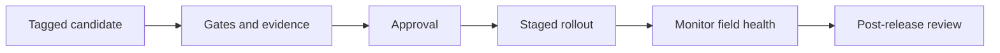

- **Owner:** Release manager
- **Applies to:** All releases, field updates, production programming and supported versions
- **Enforcement:** Release pipeline, release criteria, sign-off
- **Related:** [EG-003](eg-003-quality-policy-and-attributes.md), [EG-014](eg-014-version-control-and-versioning.md), [EG-016](eg-016-pipelines-and-quality-gates.md), [EG-017](eg-017-testing-principles-and-strategy.md), [EG-020](eg-020-observability-and-telemetry.md), [EG-022](eg-022-security-and-data-protection.md), [EG-023](eg-023-safety-regulatory-and-certification.md), [EG-010](eg-010-components-reuse-and-variants.md)
- **Principles:** LP-01 to LP-10 (see [principles.md](../business-principles/principles.md))

> **Note:** Rules marked *(core)* apply to every product and cannot be tailored. Other rules, and all numeric values, are proposed defaults that a product may tailor in its conformance profile ([EG-001](eg-001-guidelines-governance.md)).

## Purpose

Know exactly what was shipped, release only what has passed the same gates every time, update devices safely and observably, and manufacture and support them for their full life.

## Rules

1. **REL-01** The release process MUST define stages (candidate, verification, approval, publication), roles (release manager, approvers) and a checklist held in the repository.
1. **REL-02** *(core)* A release candidate MUST be a tagged commit built once by the pipeline. Only that artefact is promoted (PIP-05).
1. **REL-03** Release criteria MUST include: all gates green, no open severity 1 or 2 defect without an approved waiver, complete requirement trace at the baseline, NFRs verified, budgets within limits, documentation built, SBOM and licence check clean, security review status, and regulatory evidence complete.
1. **REL-04** A release evidence pack MUST be generated automatically: trace report, test and analysis results, coverage, defect status, SBOM, signatures and approvals. It is retained for the supported life and any regulatory period.
1. **REL-05** *(core)* Release notes MUST be generated from conventional commits and closed defects, and MUST include breaking changes, upgrade notes and known issues.
1. **REL-06** A bill of materials MUST define each baseline: firmware version, hardware revisions, bootloader, toolchain digests, configuration schema, third-party versions and test suite version.
1. **REL-07** A compatibility matrix (firmware, hardware revision, bootloader, configuration, backend) MUST be maintained, with supported upgrade paths.
1. **REL-08** The update mechanism MUST be recorded in an ADR and be authenticated, integrity-checked, atomic (A/B or equivalent), power-fail safe and able to roll back. A downgrade protection policy MUST be defined.
1. **REL-09** Rollouts MUST be staged (canary, small cohort, wider) with health gates from telemetry (OBS-09) and the ability to pause or halt.
1. **REL-10** Every release MUST be tested for upgrade from all supported previous versions and for rollback (TST-13).
1. **REL-11** A hotfix process MUST be defined with expedited approval and the same mandatory gates, followed by a post-hoc review.
1. **REL-12** A support and end-of-life policy MUST list supported versions, security update duration and communication practice.
1. **REL-13** Production programming and provisioning MUST be controlled: the factory image is a released artefact, keys and certificates are injected through a controlled secure process ([EG-022](eg-022-security-and-data-protection.md)), production test coverage is defined, and design-for-test features exist.
1. **REL-14** Manufacturing yield and failure data MUST be fed back to engineering.
1. **REL-15** Serial numbers MUST be traceable to firmware version, hardware revision and provisioning data.
1. **REL-16** Artefacts, symbols and toolchains MUST be retained so that any supported version can be rebuilt and diagnosed for its supported life.
1. **REL-17** Each release MUST have a post-release review of field results over a defined period, feeding [EG-024](eg-024-planning-delivery-and-improvement.md).

## Release flow

## Compliance

| Rule | Checked by |
|------|------------|
| REL-02, REL-04 | Release pipeline, evidence pack completeness check |
| REL-03 | Release checklist and sign-off record |
| REL-06, REL-07 | Bill of materials and matrix checks in CI |
| REL-09 | Rollout tooling and telemetry health gates |
| REL-13 | Production process audit |

## Checklist

Tick an item when it is true for your project. Rule IDs point to the detail above.

- [ ] Release stages, roles and a checklist are defined in the repository (REL-01)
- [ ] The candidate is a tagged commit built once, and that artefact is promoted (REL-02)
- [ ] Release criteria are met: gates, no open severity 1 or 2, trace, NFRs, budgets, docs, SBOM, security, regulatory (REL-03)
- [ ] The evidence pack is generated automatically and retained (REL-04)
- [ ] Release notes are generated from commits and defects (REL-05)
- [ ] A bill of materials defines each baseline (REL-06)
- [ ] A compatibility matrix and supported upgrade paths are maintained (REL-07)
- [ ] The update mechanism is recorded in an ADR: authenticated, atomic, power-fail safe, with rollback and a downgrade policy (REL-08)
- [ ] Rollouts are staged with health gates and the ability to halt (REL-09)
- [ ] Upgrade and rollback are tested from supported versions (REL-10)
- [ ] A hotfix process is defined (REL-11)
- [ ] A support and end-of-life policy is published (REL-12)
- [ ] Production programming and provisioning are controlled, with feedback, unit traceability and secure key injection (REL-13, REL-14, REL-15)
- [ ] Artefacts, symbols and toolchains are retained for the supported life (REL-16)
- [ ] A post-release review is held (REL-17)

## Applying to personal projects and AI agents

### Personal projects

Starts at the **Standard** profile (see [personal-projects.md](personal-projects.md)). Tag, build once, generate the changelog from commits and publish. Keep a one-line release checklist and write down which versions you support. Skip staged rollout and production provisioning unless you ship devices.

### AI agents

- Never create or move release tags, edit changelogs by hand or change version strings unless the task says so (VCS-10, VCS-11).
- Do not rebuild artefacts for release (REL-02).
- Put upgrade notes and breaking changes in commit footers so that release notes generate correctly (REL-05).
